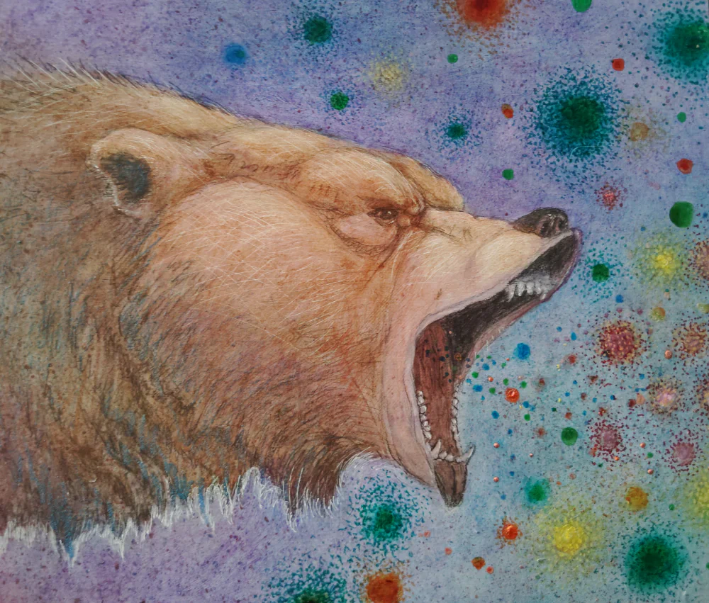
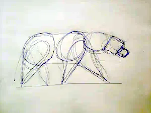
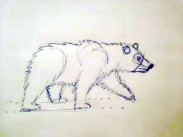
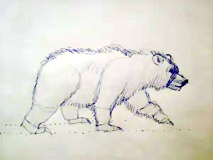
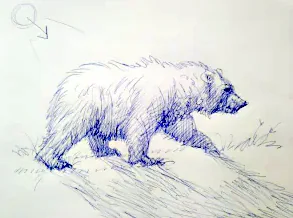
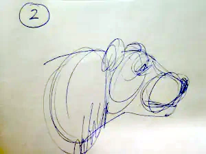

How to Sketch a Bear  
Rendering a bear can be quite challenging, for both beginners and advanced artists. This is especially true if you are using a photo reference, and do not spend much time out in the wild studying and drawing animals. The issue with using a photo or digital image is its flat, and often times the finished drawing is missing important anatomical details, giving your subject an awkward appearance. It would of be ideal if a bear could sit still and pose or us, but that is never going to happen. But don't not worry about that! I have some drawing tricks to help you get around this complication, and how to guide you thru the process of rendering a bear, and keeping it looking natural and realistic.

Step 1: Start your sketch with just a simple pencil and paper.  
There's no need to spend a lot of money on materials, and no need to get fancy. Just start a basic outline using some circles to represent the body, head and nose. Don't worry about details at this point, that will come later. Your main focus at this stage is keep it simple, and think about how the subject matter fits into a square shaped page. Also, you should have a several different photo references, with different of your bear. The reason for using several different images is it shows important details that are otherwise hidden from a flat image. These images will be your guide for all anatomical details.

Step 2: Define the Bear’s Anatomy  
Sketch lightweight pencil lines to outline muscle groups and joints. Notice how the shoulders and hips align during a walking pose. Pay attention to the animals weight balance, bears are powerful animals, and your sketch should show a thick neck and shoulders.

Step 3: Add Fur and Details  
Once you’re satisfied with the form, add short directional strokes for fur texture. Use softer lines around the belly and face, and darker, longer strokes along the back and legs for contrast.

Step 4: Now you can start refining your artwork, by adding some furry details.  
Try adding some shading to the bear, using the upper left corner as a sunlight with an arrow directional guide. Shading can really give your artwork some depth. Also try adding some grassy details to the ground next to the bears paws, this makes the artwork seem more natural.

Art Tips for Realism  
Observe references of bears walking or resting in nature videos.  
Keep your drawing lines loose in the beginning, this will prevent your creation from looking to contrived.  
Use a mirror for better proportion control.  
Use cross-hatching to shade areas like under the neck and between the legs, if using a pen or pencil, just smudge it with your finger.

vimeo video.

Conclusion  
Learning how to sketch a bear trains your eye for anatomy, rhythm, and texture. Whether you’re creating wildlife art or practicing animal anatomy, sketching bears sharpens your observation skills and brings life to your drawings.

Want to keep improving? Practice drawing your pet, or go outside and sketch whatever you see, a bird, a squirrel, or go to the zoo.

